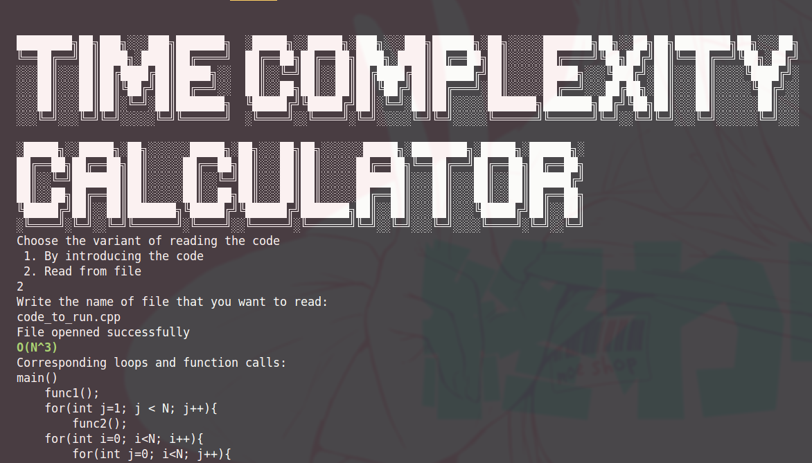

# Individual Work for DSA course
The purpose of this project is to provide a utility to analyse the Time Complexity of an algorithm written in C++

## How to use
1. Compile and run `main_code.cpp`
2. Choose what input to provide (code in file or input from keyboard)

### Keyboard input
Introduce the code line by line. If you type 2 newlines in row, programm will treat it as `EOF`.

### File input
Write the path to file with the code to be analysed

## Output
Shows the time complexity in the following form
```shell
O(n^x log^y(n))

*Loops that have built this complexty*
```
### Screenshot
 

## Functionalities and limitations
- Analyse `for` loops and function calls
- Doesn't handle recursive functions and while loops
- Basic error handling to show the problematic loop declaration 
